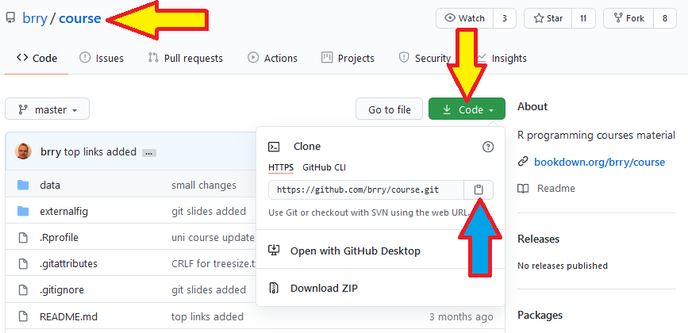
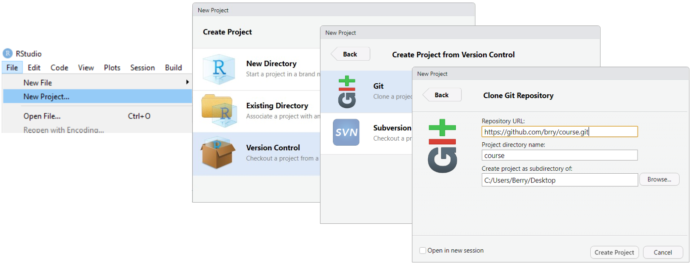
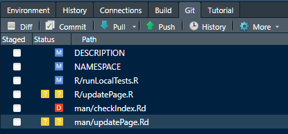
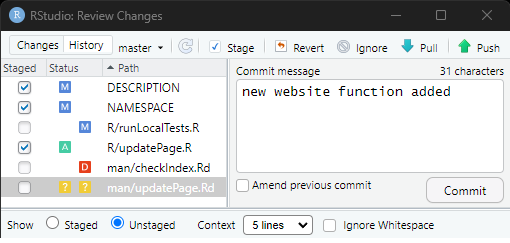
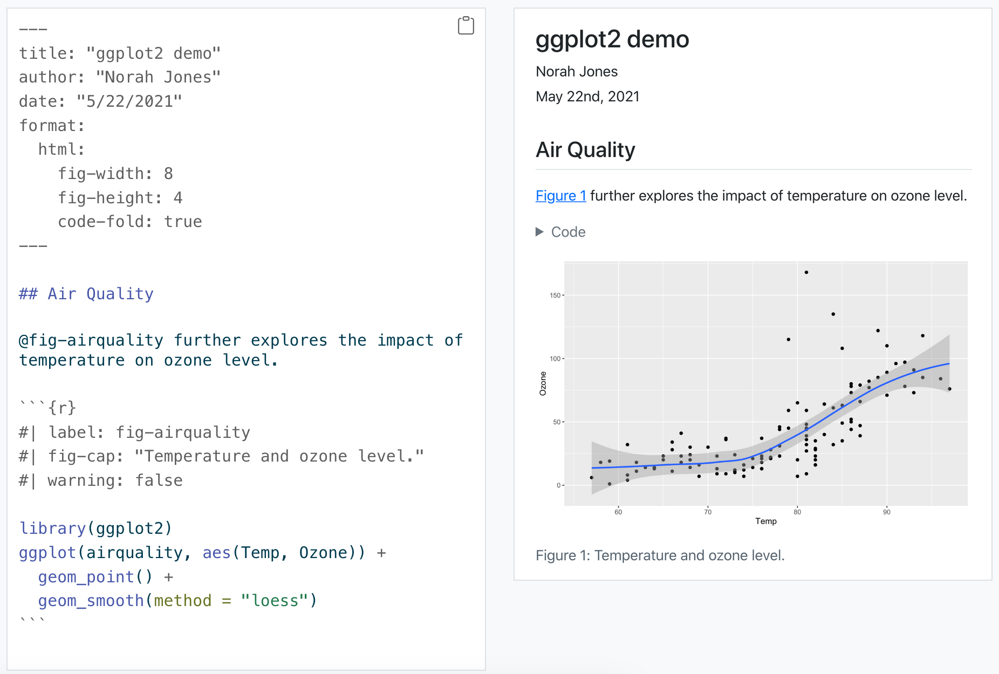

## Use git and github

-   Download repositories (online project folder)
-   Track your changes (backup + undo)
-   Develop code collaboratively
-   Host codebase + documentation website (ex: [runway](https://brry.github.io/runway/))
-   Installation [instructions](https://brry.github.io/course/git.html)

---

## Copy the URL of a github repo

{width="99%"}

---

## Clone a repo

VScode: [guide](https://code.visualstudio.com/docs/sourcecontrol/intro-to-git)

RStudio:

{width="99%"}

Keep exactly the github repo name as Project directory name!

---

## Track your changes in small batches

{width="50%"}

In a shared repo, **Pull** before you work.

Click **Commit** to select files (or parts of them) for one unit of change.

{width="50%"}

Write a short informative message (why, not what) and press **Commit**.

**Push** your commits to the github online repo.

---

## Quarto documents

-   Mix code and markdown text
-   Hassle-free and reproducible reports / presentations / websites
-   One main file with the single source of truth (SSOT)
-   Full publishing ecosystem, see [quarto.org](https://quarto.org/)
-   R and Python chunks can both be included (and hand off data to each other)
-   Many settings are available! (see [quarto.org](https://quarto.org/))
-   In RStudio, click File → New File → Quarto Document
-   In VScode, install the [quarto](https://marketplace.visualstudio.com/items?itemName=quarto.quarto) extension, create a `.qmd` file — for a template, copy content e.g. from the [quarto guide](https://quarto.org/docs/get-started/hello/vscode.html#render-and-preview)

---

## Quarto reports

{width="99%"}

---

## Quarto presentations

-   `format: revealjs`, `incremental: true`, `echo: true`
-   chalkboard, embed-resources
-   visual editor
-   `## slide title`
-   `. . .` (with blank lines) for animation
-   ``

---

## Quarto tips & tricks

-   RStudio Cog button settings:
    -   preview in Viewer pane
    -   chunk output in console
-   Name your chunks for rendering progress, debugging, figure file names, cache names
-   Use code folding :)
-   More ideas in the homework

---

## Sharing documents/presentations

In order of complexity / effort:

-   Simple qmd file in some repo: [qmd](https://github.com/brry/misc/blob/master/pueyo.qmd) → [html](https://github.com/brry/misc/blob/master/pueyo.html) → [rendered](https://html-preview.github.io/?url=https://github.com/brry/misc/blob/master/pueyo.html) ([alt](https://claude.ai/share/4e0a1b3f-83b7-4dcf-9401-bba192806cb6))
-   Readme file in dedicated github repo: [qmd](https://github.com/brry/FP25/blob/main/README.qmd) → [readme](https://github.com/brry/FP25)
-   Simple website with short URL: [qmd](https://github.com/brry/ice/blob/master/index.qmd) → [brry.github.io/ice](https://brry.github.io/ice)
-   Complex website: [qmd](https://github.com/brry/rdwd/blob/master/docs/index.Rmd) → [brry.github.io/rdwd](https://brry.github.io/rdwd)

---

## Homework

-   implement suggested changes in [4_exercise.qmd](4_exercise.qmd)

---

## Summary: use version control and quarto markdown documents

-   Copy github repo URL
-   Clone (*download*):
    -   VScode: Source Control → Clone Repository
    -   RStudio: create project (version control)
-   Work, commit, repeat
-   Pull (if in a team)
-   Push (*upload*)
-   qmd: one single main file with text and code
-   Code chunks in any programming language
-   Can be compiled to html, pdf, website
-   Homework: make changes in the qmd file
