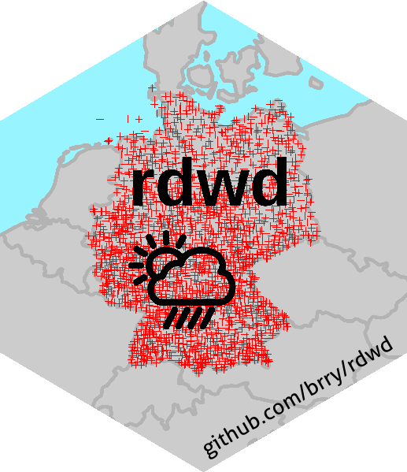
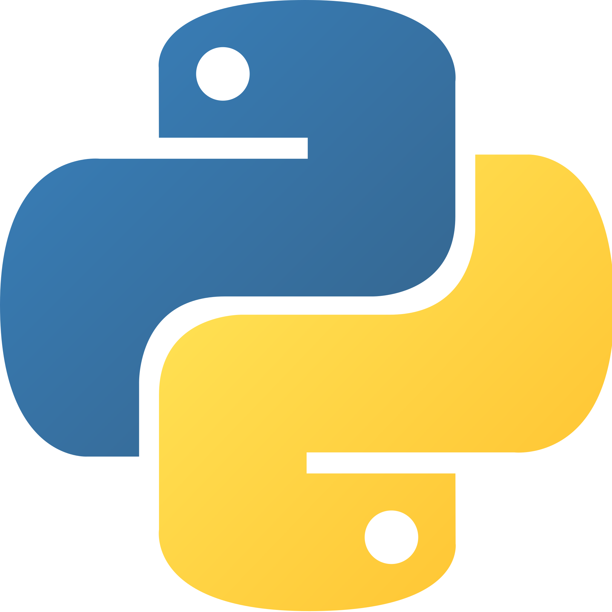
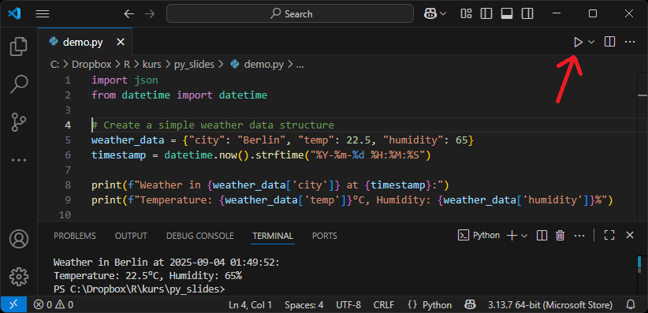

## Welcome

- Berry &nbsp;&nbsp;&nbsp; {style="height:5em;vertical-align:middle;"}
- 2008–2017 Geo-ecologie @ Potsdam University
- "accidentally" became an {style="height:1em;vertical-align:middle;"}-fan
- R-packages [{style="height:1.5em;vertical-align:middle;"}](https://github.com/brry/rdwd#rdwd),
  community [{style="height:1.3em;vertical-align:middle;"}](https://www.meetup.com/de-DE/Berlin-R-Users-Group/),
  training & consulting [{style="height:1em;vertical-align:middle;"}](https://brry.github.io)
- Since 2019 lecturer @ HPI (chair Bert Arnrich)
- Since 2021 also {style="height:1em;vertical-align:middle;"}-teacher
- Married, new father
- Renovating our house (shared with friends)
- Play [ice hockey](https://github.com/brry/ice#vis) whenever the lake is frozen
- Active in [erlebt Potsdam](https://erlebt-potsdam.de)

---

## Why learn [Python](https://www.python.org/doc/essays/blurb/) and [R](https://www.scaler.com/blog/r-for-data-science/)

- Languages for data analysis / visualization and statistics
- Widely used in research and business
- Free, open source (accountable, reproducible, expandable)
- Large user community (many methods)
- Interpreted language (no compilation)
- High-level (readable for humans)
- Dynamic typing and binding (data type checked at run-time)
- **Python:** object-oriented (methods bundled with data)
- **R:** functional (functions return reproducible results)
- Coding makes your work efficient, productive and replicable

---

## When to use which language

in descending order of importance:

- Use what you're most comfortable with!
- Use what your team uses
- Choose by strengths (ease of use, choice of packages):
  - Python: Machine Learning
  - R: stats / visualisation / data analysis
  - (both can do all of this)
- Choose by programming philosophy:
  - Python: object-oriented (methods bundled with data)
  - R: functional (functions return reproducible results)
- Choose by implementation details:
  - Python: informative error messages, systematic function naming
  - R: easy install, easy REPL, **`F1`** for help, systematic code syntax

---

## Good coding practices

- DRY: Don't repeat yourself
- Do not maintain multiple variants of code!
- Duplicate code → function / vectorize / loop
- Code should be clear, simple, modular, documented, fast, tested
- Many concrete tips at [brry.github.io/course/good-practice.html](https://brry.github.io/course/good-practice.html)

---

## IDEs

**I**ntegrated **D**evelopment **E**nvironment

- If you already like one, use it!
- Otherwise:
- Use {style="height:2em;vertical-align:middle;"} for Python
- Use {style="height:2em;vertical-align:middle;"} for R
- software installation guide in separate file [3_installation.html](3_installation.html)

---

## Overview: VS Code

- Run script with play button (or custom keyboard shortcut)
- Run line / selection with **SHIFT** / **CTRL** + **ENTER**
- Type `quit()` to get out of REPL mode (Read–eval–print loop)

---

## Overview: RStudio

